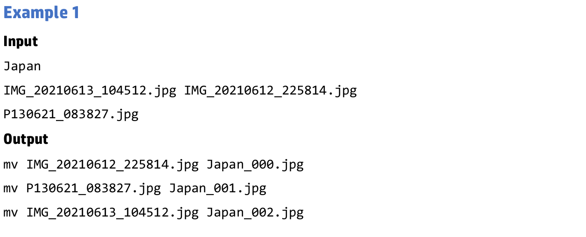
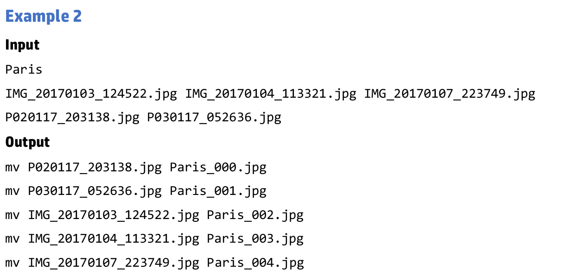
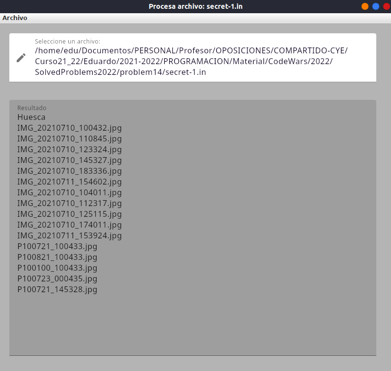
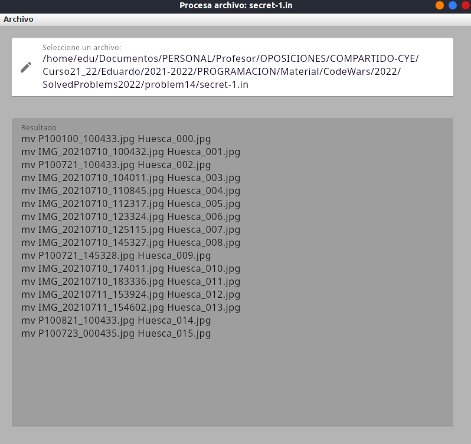

# Prueba especifica unidad 7

> Se evaluará el RA5

## 1. Problema 2022 (14)

A Enrique le encanta viajar con sus amigos. Le gusta descubrir nuevos lugares y tomar fotos todo el tiempo. Sin
embargo, al volver a casa, tiene que clasificar y archivar todas las fotografías que él y sus amigos han tomado, y esa
es una tarea muy larga y aburrida. Siempre hay dos tipos de archivos de fotos, los que sacan los smartphones y los
que saca la cámara réflex de Enrique. Los archivos tienen una estructura de nombres diferente, que es la siguiente:

Las cámaras de los teléfonos inteligentes usan el formato `IMG_YYYYMMDD_HHMMSS.jpg`, donde `YYYY` es el año,
`MM` es el mes y `DD` es el día del mes. Por ejemplo: `IMG_20171203_213455.jpg` corresponde a una foto tomada el 3 de
diciembre de 2017 a las 21:34:55.

Los archivos de la cámara Reflex se almacenan en el formato `PDDMMYY_HHMMSS.jpg`, donde `DD` es el día del
mes, `MM` es el mes y `YY` son los dos últimos dígitos de un año (suponiendo que es un año del siglo XXI). Por ejemplo:
`P031217_213455.jpg` corresponde a una foto tomada el 3 de diciembre de 2017, a las 21:34:55.

En ambos casos,`HHMMSS` es la marca de tiempo, con `HH` para la hora (0 a 23), `MM` para el minuto (0 a 59) y `SS` para
los segundos (0 a 59).

Dados estos dos formatos diferentes, es imposible ordenar los archivos automáticamente por nombre, ya que todos los
`IMG_` se colocarían antes que los `P_`. A Enrique le gustaría obtener un script de Linux para cambiar el nombre de todos
los archivos de manera que incluyan el nombre del lugar que visitaron, seguido de un contador de tres dígitos, que
comienza desde `000` para la imagen más antigua y crece una unidad para cada siguiente foto, ordenadas por fecha y
hora en que fueron tomadas. El comando de Linux `mv` es lo suficientemente bueno para cambiar el nombre de los
archivos de esta manera.>

> Nota: la sintaxis del comando `mv` es:
> `mv <origen> <destino>`

> Nota: habrá menos de 1000 fotos en cada colección.

### Entrada

La entrada constará de 3 líneas:

- El nombre del lugar visitado en el viaje. Siempre será una palabra.
- Una lista de los archivos de fotos provenientes de las cámaras del smartphone, separados por un espacio.
- Una lista de los archivos de fotos provenientes de la cámara réflex, separados por un espacio.

### Salida

El resultado será la lista de comandos `mv` a ejecutar para cambiar el nombre de todos los archivos. Enrique también quiere que la lista esté ordenada por el nuevo nombre del archivo, por lo que el primer comando debe ser el que convierta la foto más antigua.

### Ejemplos

## 2. ¿Qué se pide?

1. Poder elegir el fichero y lectura de este. Menú item `Abrir` e icono de lapiz.
   
2. Procesar el fichero para que muestre el resultado de salida. Menú item `Procesar`. No se podrá procesar si no hay archivo seleccionado. Permaneciendo inactivo mientras tanto.
   
3. Exportar el resultado a un archivo con el mismo path y nombre que el de entrada, con extensión `.sh`. Menú item `Exportar` y botón `Exportar`. Solo permitirá exportar si previamente se ha procesado, permaneciendo inactivo mientras tanto.

## 3. Ejecución y test
Para probar la práctica se utilizarán los archivos `.in` que hay en el directorio `examples` y otro archivos similares.

- Deberá cargar adecuadamente el archivo.
- Deberá procesar la entrada y generar el resultado correcto.
- Deberá exportar el resultado a un archivo.

## 4. Evaluación

Se tendrá en cuenta el uso de clases, y de jerarquía de clases propias si son necesarias o ya conocidas y que nos las proporcionan kotlin, como por ejemplo List, Map, Set. etc.

###### Carga y exporta adecuadamente el archivo
0. No lo hace; 5. Lee y exporta el archivo; 10. Lee y exporta, controlando errores relacionado con operaciones de entrada y salida.
###### Procesa adecuadamente el archivo según el problema descrito.
0. No lo hace; 3 Procesa aunque no es completamente correcto; 6. Procesa correctamente controlando errores del archivo.
###### La IU funciona como se describe y añade la funcionalidad necesaria
0. No lo hace; 5. Funcionalidad descrita básica; 10. Incorpora nuevos elementos y controla errores. 

Adicionalmente se tendrá en cuenta:
- El código realizado es óptimo.
- El código realizado es limpio y está comentado.
- Se cumple requisitos de entrega.

## 5. Condiciones de entrega

Se entrega la URL al repositorio, el repositorio será:

- **privado**
- Compartido conmigo.
- El nombre del repositorio será `DAM1_id_iniciales` donde:
    - `id`: es el ide de la actividad, por ejemplo pe_un7
    - `iniciales': son tus iniciales por ejemplo EFO las mías.

## 4. Bibliografía
